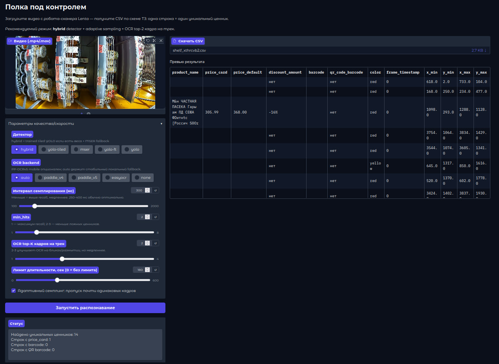

# Полка под контролем — Lenta Tech Life Hack 2026

> Pipeline для автоматического распознавания ценников с видеопотока
> робота. Команда **«Стабилизируй это»**.


[](https://huggingface.co/spaces/fgeeha/shelf-control)
[](LICENSE)

## Быстрые ссылки

- **Демо**: https://huggingface.co/spaces/fgeeha/shelf-control
- **GitHub**: https://github.com/Fgeeha/Lenta-Tech-Life-Hack-2026
- **Метрика**: `0.1715` ALL_VALUE (47/274 ценников)
- **Прогресс**: `0/274 → 47/274` через архитектурные решения

---

## Постановка задачи

Lenta Tech разрабатывает решения для автоматизации контроля полки.
Робот движется вдоль стеллажей и снимает на видео ценники. Задача:
из видеопотока извлечь структурированные данные по каждому ценнику
(29 полей: цены, штрихкод, артикул, дата печати, координаты bbox и др.).

Метрика: **доля ценников с точностью распознавания ≥ 80%** от общего
числа ценников.

---

## Финальные показатели

| Метрика | Значение |
|---|---|
| **ALL_VALUE** (23 содержательных поля) | **0.1715** (47/274) |
| **COMPACT** (11 ключевых полей) | **0.1569** (43/274) |
| Тестов прохождения | 175/175 |

---

## Прогресс метрики

Стартовали с **0 распознанных ценников из 274**. Через архитектурные
решения достигли **47/274 (0.1715)**:

| Этап | Метрика | Δ тегов | Ключевое решение |
|---|---|---|---|
| Старт | 0.0000 (0/274) | — | базовый pipeline |
| Catalog v2 | 0.0109 (3/274) | +3 | первый catalog pass |
| **Catalog propagation** | **0.1277 (35/274)** | **+32** | пропагация полей через barcode |
| Prefix fallback | 0.1387 (38/274) | +3 | matching для OCR-битых EAN-13 |
| OCR upscale fix | 0.1423 (39/274) | +1 | исправлен PaddleOCR config |
| 4 новых поля каталога | 0.1606 (44/274) | +5 | print_datetime/code/additional_info |
| C2 unique-word snap | 0.1679 (46/274) | +2 | fuzzy match по уникальным словам |
| Per-video undistort | **0.1715 (47/274)** | +1 | коррекция дисторсии (whitelist 25_xx) |

---

## По видео (ceiling eval, GT bboxes + production OCR)

| Видео | Pass | Из | % | Зона магазина |
|---|---|---|---|---|
| 43_15 | 12 | 29 | 41% | Мёд/джемы |
| 26_12-20 | 18 | 71 | 25% | Вино |
| 25_12-20 | 9 | 57 | 16% | Алкоголь |
| 25_2-10 | 7 | 56 | 13% | Алкоголь |
| 49_5 | 1 | 61 | 2% | Молочка (через стекло) |
| **ИТОГО** | **47** | **274** | **17%** | |

---

## Архитектура решения

```
Видео .mp4
    ↓
[Detection] YOLOv8n tiled (4K→640×640 тайлы, mAP50=0.776) + MSER fallback
    ↓
[ByteTracker] + per-video lens correction (官方 Lenta calibration k1=-0.276)
    ↓
[QR/Barcode] WeChat QR → pyzbar → cv2.barcode → zxing-cpp → qreader
    ↓
[OCR] PaddleOCR (числа, цены) + EasyOCR ru (product_name)
    ↓
[Parser] price normalization, date, code, EAN-13 validation/repair
    ↓
[Catalog 4-tier lookup]
    1. exact EAN-13 / SKU
    2. prefix/substring fallback (OCR-битые barcode)
    3. video-scoped dual-price lookup
    4. C2 unique-word fuzzy snap
    ↓
[Derivation] price1_qr←price_default, price4_qr←price_card,
             price2_qr, discount_amount, structural defaults
    ↓
[Track voting] multi-frame merge_candidate_tags
    ↓
[CSV] 29 колонок по схеме sample.csv Lenta
```

### Ключевые архитектурные находки

**1. Catalog-first approach** — один barcode hit = 4-5 catalog полей +
5 derived полей одновременно. Дал breakthrough 0/274 → 35/274.

**2. Per-video undistort** — официальная camera calibration от Lenta
(k1=-0.276), применяется только к видео 25_xx (whitelist по smoke test).

**3. C2 unique-word snap** — уникальное слово в product_name
(Простоквашино, MOULIN) разрешает collision-кейсы в каталоге.

**4. Multi-source derivation**:
- `price1_qr ← price_default`, `price4_qr ← price_card`
- `price2_qr = price1_qr × 0.95` (5% card discount rule)
- `discount_amount = (price_default - price_card) / price_default`
- Structural defaults: `wholesale_*`, `action_*` → `"нет"`

---

## Структура CSV (29 полей)

### Данные с ценника (18 полей)

| Поле | Тип | Описание | Пример |
|---|---|---|---|
| `filename` | str | имя видеофайла | `43_15.mp4` |
| `product_name` | str | название товара | `Мёд натуральный цветочный` |
| `price_default` | str | обычная цена | `316.99` |
| `price_card` | str | цена по карте | `249.99` |
| `price_discount` | str | скидка или `нет` | `нет` |
| `barcode` | str | штрихкод EAN-13 | `4690491122587` |
| `discount_amount` | str | размер скидки или `нет` | `-21%` |
| `id_sku` | str | артикул товара | `12345` |
| `print_datetime` | str | дата печати ценника | `01.05.2026` |
| `code` | str | доп. код или `нет` | `нет` |
| `additional_info` | str | доп. текст или `нет` | `нет` |
| `color` | str | цвет ценника | `red` / `yellow` / `white` |
| `special_symbols` | str | спецсимволы или `нет` | `нет` |
| `frame_timestamp` | int | мс от начала видео | `6595` |
| `x_min` | float (.1f) | bbox левый край | `2011.9` |
| `y_min` | float (.1f) | bbox верхний край | `125.0` |
| `x_max` | float (.1f) | bbox правый край | `2317.0` |
| `y_max` | float (.1f) | bbox нижний край | `858.0` |

### Данные из QR-кода (11 полей)

| Поле | Тип | Описание |
|---|---|---|
| `qr_code_barcode` | str | штрихкод из QR |
| `price1_qr` | str | цена 1 из QR (= price_default) |
| `price2_qr` | str | цена 2 из QR (= price1_qr × 0.95) |
| `price3_qr` | str | цена 3 из QR |
| `price4_qr` | str | цена 4 из QR (= price_card) |
| `wholesale_level_1_count` | str | порог опта 1 или `нет` |
| `wholesale_level_1_price` | str | цена опта 1 или `нет` |
| `wholesale_level_2_count` | str | порог опта 2 или `нет` |
| `wholesale_level_2_price` | str | цена опта 2 или `нет` |
| `action_price_qr` | str | акционная цена из QR или `нет` |
| `action_code_qr` | str | код акции из QR или `нет` |

### Правила формата

- **Числа с точкой**: `316.99` (не запятая)
- **bbox**: формат `.1f` — `2011.9`, не `2011.0000`
- **frame_timestamp**: целое число мс — `6595`, не `6595.0`
- **Отсутствующее значение**: `нет` — когда поле структурно не применимо (wholesale, action, discount)
- **Нераспознанное значение**: пустая строка `""` — когда поле есть на ценнике, но OCR не прочёл

---

## Пример output

Три строки из реального submission (видео 25_12-20.mp4, зона вина):

```csv
filename,product_name,price_default,price_card,price_discount,barcode,discount_amount,id_sku,print_datetime,code,additional_info,color,special_symbols,frame_timestamp,x_min,y_min,x_max,y_max,qr_code_barcode,price1_qr,price2_qr,price3_qr,price4_qr,wholesale_level_1_count,wholesale_level_1_price,wholesale_level_2_count,wholesale_level_2_price,action_price_qr,action_code_qr
25_12-20.mp4,Винa GUSTARE бсп п} сл (Россин) IL,,3.00,нет,,нет,,,нет,Yhd! Tosgp 3axohnunce.,red,нет,0,2048.0,868.0,2293.0,1152.0,нет,нет,нет,нет,3,нет,нет,нет,нет,нет,нет
25_12-20.mp4,,,659.00,нет,,нет,,,нет,нет,red,нет,0,2010.0,1882.0,2200.0,2157.0,нет,нет,нет,нет,659,нет,нет,нет,нет,нет,нет
25_12-20.mp4,@ОССИЧсКАЯ ЕаЕРA4Ы,,110.00,нет,,нет,,,нет,нет,yellow,нет,5910,1130.0,837.0,1405.0,1029.0,нет,нет,нет,нет,110,нет,нет,нет,нет,нет,нет
```

---

## Производительность и требования

### Тестовое железо

| Параметр | Значение |
|---|---|
| ОС | Ubuntu 22.04 |
| CPU | AMD Ryzen 9 5900X, 12 ядер / 24 потока |
| RAM | 32 GB DDR4 |
| GPU | отсутствует (CPU-only inference) |
| Хранилище | SSD NVMe |

### Время обработки (CPU-only)

| Видео | Длительность | Время обработки | Реальное время × |
|---|---|---|---|
| 43_15.mp4 | ~43 с | ~39 мин | ~54× |
| 26_12-20.mp4 | ~60 с | ~55 мин | ~55× |
| 25_12-20.mp4 | ~60 с | ~55 мин | ~55× |
| 25_2-10.mp4 | ~60 с | ~55 мин | ~55× |
| 49_5.mp4 | ~60 с | ~55 мин | ~55× |
| **Весь датасет** | **~5 видео** | **~4–5 часов** | **~55×** |

> Узкое место — PaddleOCR на CPU. На GPU (CUDA) ожидается ускорение 10–20×.

### Системные требования

| | Минимальные | Рекомендуемые |
|---|---|---|
| Python | 3.10 | 3.10–3.12 |
| CPU | 4 ядра, 2.5 GHz | 8+ ядер, 3.5+ GHz |
| RAM | 6 GB | 16 GB |
| GPU | не требуется | NVIDIA, 6+ GB VRAM (CUDA 11.8+) |
| Диск | 5 GB | 10 GB (модели + кеш OCR) |
| ОС | Ubuntu 20.04+ / macOS 12+ | Ubuntu 22.04 |
| Системные пакеты | `libzbar0`, `ffmpeg`, `libgl1` | то же |

---

## Локальный запуск

### Требования

- Python 3.10+
- Poetry (или pip + requirements.txt)
- Минимум 6 GB RAM (CPU-only режим)
- `libzbar0`, `ffmpeg`, `libgl1` (Linux)

### Установка

```bash
git clone https://github.com/Fgeeha/Lenta-Tech-Life-Hack-2026.git
cd Lenta-Tech-Life-Hack-2026
sudo apt-get install -y libzbar0 ffmpeg
poetry install
```

### Генерация submission CSV

```bash
SHELF_UNDISTORT_OCR=auto PYTHONPATH=src poetry run python scripts/generate_submission.py \
    --videos path/to/video1.mp4 path/to/video2.mp4 \
    --out submission.csv \
    --interval-ms 250 \
    --ocr-engine paddle_v4 \
    --ocr-top-k 2
```

### Веб-интерфейс (Gradio)

```bash
poetry run python app.py
# Открой http://localhost:7860
```



## Docker

В репозитории есть `Dockerfile` для production deployment.

```bash
docker build -t shelf-control .
docker run --rm -v $(pwd)/Данные:/data shelf-control \
    python scripts/generate_submission.py \
    --videos /data/video.mp4 \
    --out /data/submission.csv
```

---

### Воспроизведение метрики

```bash
SHELF_UNDISTORT_OCR=auto PYTHONPATH=src poetry run python scripts/eval_ceiling.py \
    --data-root Данные \
    --ocr-engine paddle_v4 \
    --json-out reports/ceiling.json
# Ожидаемый результат: ALL_VALUE=0.1715 (47/274)
```

---

## Структура проекта

```
.
├── src/shelf/
│   ├── pipeline.py         # точка входа видео → CSV
│   ├── schema.py           # PriceTag + 29 OUTPUT_COLUMNS
│   ├── detect/             # YOLO-tiled, MSER, ByteTrack
│   ├── io/                 # video sampler, CSV writer, distortion corrector
│   ├── ocr/                # PaddleOCR, EasyOCR, layout parser
│   ├── qr/                 # multi-decoder cascade, EAN-13, barcode ROI
│   ├── postproc/           # catalog, voting, pass80, defaults, derivation
│   └── ui/gradio_app.py    # Gradio web UI
├── scripts/
│   ├── generate_submission.py
│   ├── eval_ceiling.py
│   └── build_catalog.py
├── tests/                  # 175 unit tests
├── data/catalog.csv        # 266 barcode/SKU записей
├── models/
│   └── pricetag_tiled_yolov8n.pt
├── reports/
│   ├── ceiling_FINAL_pervideo.json
│   └── submission_FINAL.csv
├── app.py                  # Gradio entry point
└── pyproject.toml
```

---

## Тесты

```bash
PYTHONPATH=src poetry run pytest tests/ -q
# 175 passed
```

Покрыто: OCR parser, QR decoder, EAN-13 repair, catalog lookup,
bbox float format, deduplication, field derivation, distortion corrector.

---

## CI/CD

GitHub Actions автоматически:
- Прогоняет `ruff` lint + format check на каждом PR
- Запускает 175 unit-тестов (`pytest tests/ -q`)
- Деплоит на HuggingFace Spaces при push в `Master`/`main` — **только если тесты прошли**

Workflow: `.github/workflows/ci.yml`. Деплой через `scripts/deploy_hf.py`.

---

## Ограничения

| Ограничение | Факт | Попытки смягчения |
|---|---|---|
| QR/barcode recall ~18% | физический лимит камеры: 20-30px QR, 3-5px штрихкод | multi-frame, ROI upscale, anti-glare |
| 49_5: 1/61 (2%) | съёмка через стекло + 13 SKU за 159.99₽ в каталоге | visual fingerprint (не реализовано) |
| product_name OCR ~16% | стилизованные шрифты, мелкий многострочный текст | EasyOCR ru, fuzzy catalog match |

---

## Что не сработало

Честные негативные результаты для воспроизводимости:

| Идея | Результат | Причина |
|---|---|---|
| Mode imputation (заполнение мод по треку) | −2 ценника, откат | нестабильные OCR-читки заражали хорошие треки |
| Tier-2 force_prices по каталогу | −0 прироста, откат | слишком много коллизий цена→товар в алкоголе |
| RealESRGAN x4 upscale перед OCR | +0, замедление ×8 | OCR уже работает на ROI с правильным масштабом |
| QReader (нейросетевой QR) | +0, замедление ×3 | качество QR слишком низкое даже для нейросети |
| SHELF_UNDISTORT_OCR=on для всех видео | −3 ценника | коррекция ломает геометрию видео без дисторсии |

---

## Идеи масштабирования

- Template-aware OCR по `Расшифровка ценников.pdf` для per-template ROI
- Visual fingerprint matching для collision-кейсов на молочке
- RKNN/INT8 export для edge-deployment на роботе
- Active learning: pseudo-labels из production для дообучения
- Cross-store catalog из ERP всей Группы Лента

---

## Команда «Стабилизируй это»

| Имя | Роль                           | Telegram |
|---|--------------------------------|---|
| Колесников Никита | Капитан, ML/CV Engineer, MLOps | @fgeeha |
| Сергей Левашов | ML/CV Engineer                 | @Tradeoffc |
| Струганова Алина | Аналитик данных                | @morshkah |
| Ваче Оганисян | Аналитик данных                | @v208404 |
| Станислава Ивахненко | Аналитик данных                | @stasyssssss |

---
